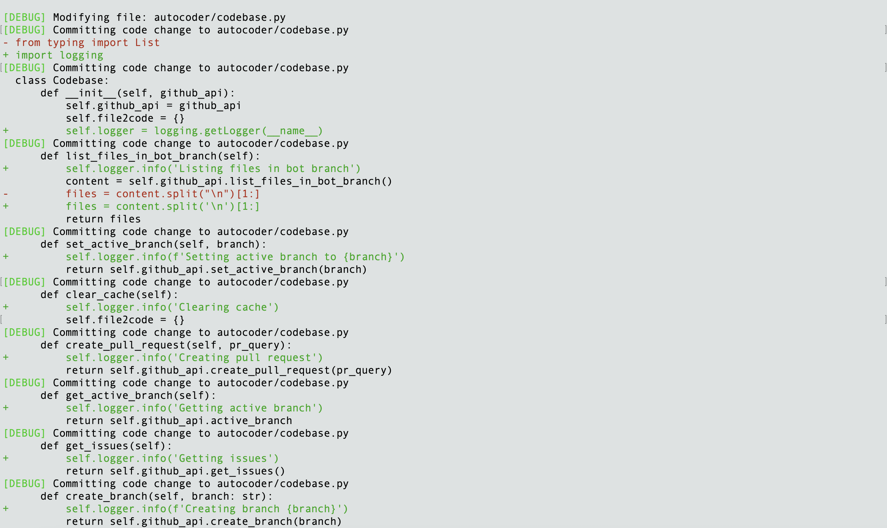
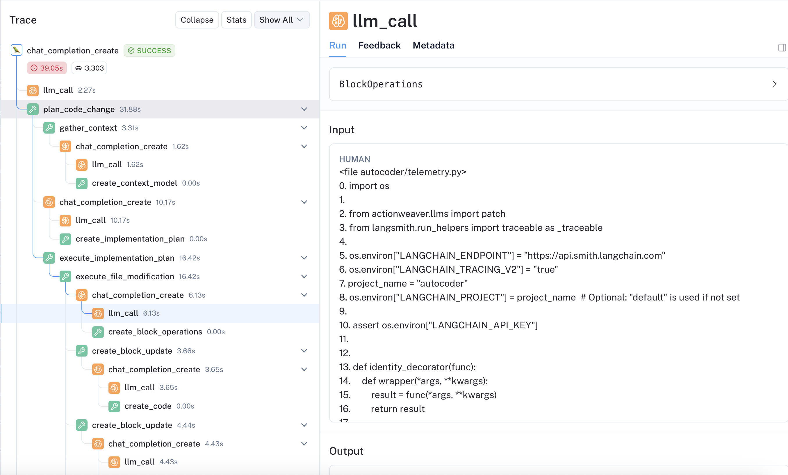

# How AutoCoder works (01/28)


AutoCoder is a coding agent that allows users to read and write codebase by interacting with it through natural language conversation. It is capable of performing various tasks related to code management, such as creating and switching branches, reading issues, answering questions about the codebase, committing code changes based on instructions, and creating pull requests. AutoCoder is powered by a LLM with function calling capability, such as gpt-4-32k on Azure, and its functions are managed and orchestrated by [ActionWeaver](https://github.com/TengHu/ActionWeaver).

To interact with the AutoCoder agent, you can either use the `notebook/demo.ipynb` or run the main.py script, where LLMs are created and patched with [ActionWeaver](https://github.com/TengHu/ActionWeaver), Github Client and a vector index are created.

The core logic of AutoCoder resides in `autocoder/bot/py`. When interacting with AutoCoder like `autocoder(user_input)`, an ActionWeaver patched LLM is invoked with following parameters:

```python
self.messages.append(
    {
        "role": "user",
        "content": "<user_query>\n" + input + "\n</user_query>",
    }
)
response = self.client.chat.completions.create(
    model=MODEL,
    messages=self.messages,
    actions=[
        self.get_issues,
        self.question_answer,
        self.list_all_files,
        self.create_pull_request,
        self.plan_code_change,
        self.create_branch,
        self.set_active_branch,
    ],
    orch={
        self.plan_code_change.name: self.summarize_changes,
        self.create_pull_request.name: None,
        self.create_branch.name: None,
        self.list_all_files.name: None,
        self.set_active_branch.name: None,
    },
    token_usage_tracker=TokenUsageTracker(500),
)
```
- `actions` parameter: The LLM, based on the user's query and action docstring, decides which action to invoke from this set of predefined actions, e.g. create_branch

```python
@action(name="CreateBranch")
def create_branch(self, branch: str):
    """
    Create a new Git branch.
    """
    msg = self.codebase.create_branch(branch)
    print(format_debug_msg(msg))
    return msg
```

- `orch` parameter: Users can have fine-grained control over functions presented to LLM using `orch` parameter, e.g. 
`self.plan_code_change.name: self.summarize_changes` enforce LLM to invoke `summarize_changes` action after `plan_code_change` invoked. For details, please take a look at https://github.com/TengHu/ActionWeaver?tab=readme-ov-file#orchestration-of-actions-experimental.


## Planning Code Changes

One of the most complex actions in AutoCoder is `plan_code_change`, which is responsible for planning and executing code changes. This action involves several steps:

- Gathering relevant context using Retrieval-Augmented Generation (RAG).
- Creating a file-level implementation plan, which includes tasks related to file creation and file modification defined in `autocoder/pydantic_models/file_ops.py` as pydantic models.
- Executing the implementation plan, which involves generating code and committing it to GitHub.

For file creation tasks, AutoCoder iterates through the tasks, gathers context, and asks the LLM to generate code based on the context. It then commits the code to GitHub iteratively.

For file modification tasks

1. AutoCoder initially reads the content from targeted file, including line numbers for reference, e.g.

```python
<file autocoder/telemetry.py>
0. import os
1. 
2. from actionweaver.llms import patch
3. from langsmith.run_helpers import traceable as _traceable
4. 
5. os.environ["LANGCHAIN_ENDPOINT"] = "https://api.smith.langchain.com"
6. os.environ["LANGCHAIN_TRACING_V2"] = "true"
7. project_name = "autocoder"
8. os.environ["LANGCHAIN_PROJECT"] = project_name  # Optional: "default" is used if not set
9. 
10. assert os.environ["LANGCHAIN_API_KEY"]
</file autocoder/telemetry.py>
```

        
2. It identifies the specific code blocks that are targeted for modification using BlockOpOnLineIdx in `autocoder/pydantic_models/code_blocks_op.py`.
3. The code blocks are iteratively rewritten according to the provided instructions.
 4. The changes are committed individually, one at a time.



## Interacting with GitHub

The logic for interacting with GitHub is implemented in `autocoder/codebase.py`. AutoCoder communicates with GitHub through the `GitHubAPIWrapper` from [LangChain Community](https://github.com/langchain-ai/langchain/tree/master/libs/community).

##  Understanding the Target Repository through RAG

Understanding the target repository (one you want AutoCoder to work on) and fetching the right context is KEY to the entire workflow. AutoCoder employs RAG techniques implemented in `autocoder/index.py` and it's using [LlamaIndex](https://github.com/run-llama/llama_index) for RAG indexing and retrieval tasks. 

- Index Building: 
During the index initialization, we first use `CodeSplitter` from llama index to chunk the files, and then uses `OpenAIEmbedding` to generate embeddings for each of these chunks and store in the VectorStore.

- Retrieving:
Several sequential steps are part of this process, including:
  - We use `HyDEQueryTransform` from Llama Index to improve the query using  
  **Hypothetical Document Embeddings (HyDE)** technique.
  - Retrieve top 50 nodes based on similarity from vector store.
  - I also experimented with LLMRerank but didn't get good results.
  - At last, we limit the selection to only the top 5 nodes, due to context and LLM constraints.

During the postprocessing, we examine code snippets within each file, merge them if there is overlapping content and drop small code snippets less than 25 lines.

##  Tracing

Tracing is an essential part of developing AutoCoder. Thanks to [LangSmith](https://www.langchain.com/langsmith), tracing is much easier for AI developers.




Take a look at `autocoder/telemetry`. Autocoder uses `trace_client` to patch OpenAI client and enhance it with LangSmith tracing capabilities.

To use LangSmith, you need a LangChain account and setup the `LANGCHAIN_API_KEY` environment variable.

