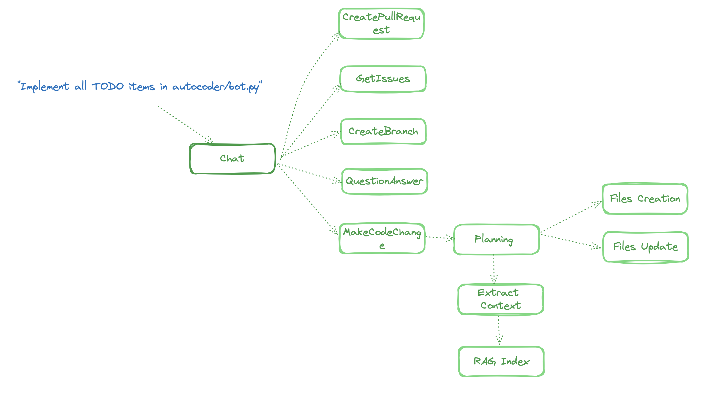

# AutoCoder: An Experimental Coding Agent

AutoCoder is a cutting-edge, experimental coding agent that leverages the power of LLM, [ActionWeaver](https://github.com/TengHu/ActionWeaver) for function calling & orchestration, [LLamaIndex](https://www.llamaindex.ai/) for Retrieval-Augmented Generation (RAG), [Langchain](https://www.langchain.com/) community and [Langsmith](https://www.langchain.com/langsmith) for observability.

Please note that this demo app is not intended for production use. This bot is only looking at python files at the moment.

## Architecture 

## Capabilities
AutoCoder is capable of following tasks:
-  GetIssues
    - **Description**: Fetches a list of issues from the GitHub repository.
    - **Example Question**: "Give me all active issues."
- QuestionAnswer
    - **Description**: Answers questions about the codebase.
    - **Example Question**: "How is the AutoCoder class implemented?"
- CreatePullRequest
    - **Description**: Creates a new Pull Request in a Git repository.
    - **Example Question**: "Create a PR."
- PlanAndImplementCodeChange
    - **Description**: Plans and implements code changes based on a given description.
    - **Example Question**: "Update the `autocoder/bot.py` to use AzureOpenAI instead of OpenAI."

## Local Setup Guide

### Step 1: Create a GitHub App
- Follow the instructions on creating a GitHub App on [GitHub's documentation](https://docs.github.com/en/apps/creating-github-apps/about-creating-github-apps/about-creating-github-apps#building-a-github-app).
- Grant the Autocoder app Read and Write access in [GitHub App settings](https://github.com/settings/installations). It should have access to administration, code, discussions, issues, pull requests, and repository projects for the intended repository.

### Step 2: Set Up Environment Variables
- **GitHub API Access**: Set `GITHUB_APP_ID` and `GITHUB_APP_PRIVATE_KEY`.
- **OpenAI Access**: Set `OPENAI_API_KEY` and specify the model in `MODEL`, e.g., `MODEL=gpt-4-0613`.
- **Langchain Monitoring** (Optional): Set `LANGCHAIN_API_KEY`.

### Step 3: Explore the Demo Notebook or main.py
- Use `notebooks/demo.ipynb` for a practical introduction and experimentation.

## Example Pull Requests

- INSTRUCTION: Enhance the 'Example Pull Requests' section in the README.md to be more detailed and descriptive.
  - [PR](https://github.com/TengHu/AutoCoder/pull/77), [LangSmith traces](https://smith.langchain.com/public/11db987a-70c6-4f96-97b6-77db702e67d0/r)
- INSTRUCTION: Updating `autocoder/bot.py` to use AzureOpenAI instead of OpenAI client.
  - [PR](https://github.com/TengHu/AutoCoder/pull/81), [LangSmith traces](https://smith.langchain.com/o/2a666482-a835-4718-9413-7991c7a8fbdf/projects/p/080603e5-0dba-4e2b-ab57-bd6707f355f2?timeModel=%7B%22duration%22%3A%227d%22%7D&tab=0&runtab=0&peek=1c3f8247-bc5f-4626-93c9-a1e7b776006c)
- INSTRUCTION: Creating separate files for classes found in autocoder/pydantic_models/file_ops.py
  - [PR](), [LangSmith traces]()

- INSTRUCTION: - Implementing AutoCoder class in `AutoCoder.java` or Lisp.
  - Too much context

- Fixing to-dos.
- Renaming functions.
- Reading and interpreting LeetCode questions.
- Implementing AutoCoder class in `AutoCoder.java` or Lisp.
  

## Tips

- **Precision in Requests**: When requesting the bot to perform tasks, be precise with file paths and provide detailed, descriptive information instead of one-liner.
- **Handling Partial Implementations**: The bot may occasionally insert comments such as "to-be-implemented" rather than fully writing out the code. In such cases, you can guide the bot towards the desired outcome through multiple rounds of conversation.

## Contributing
We welcome contributions from the open-source community.

## License
Apache License 2.0

